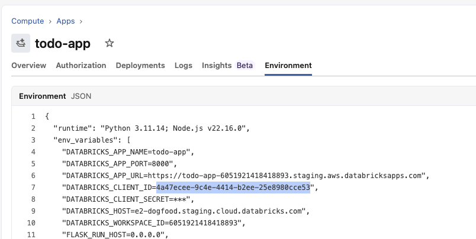
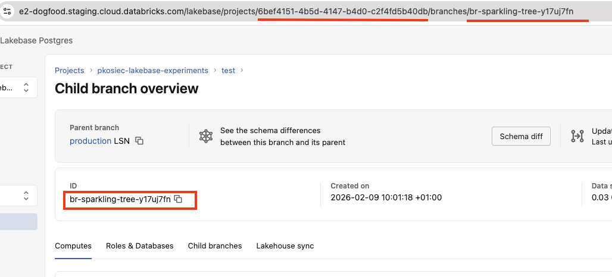
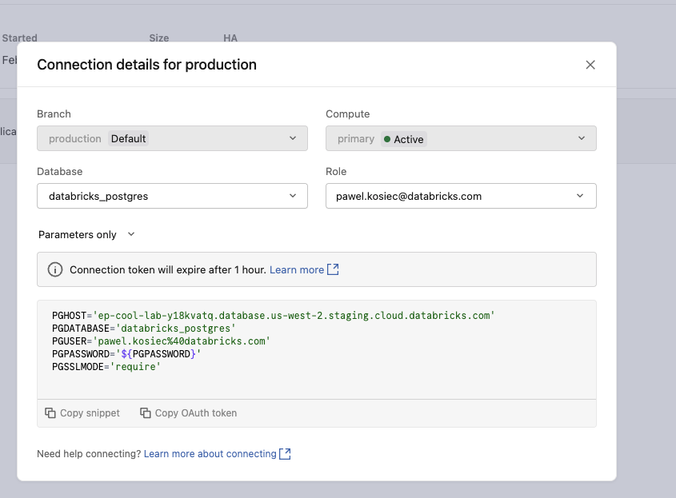
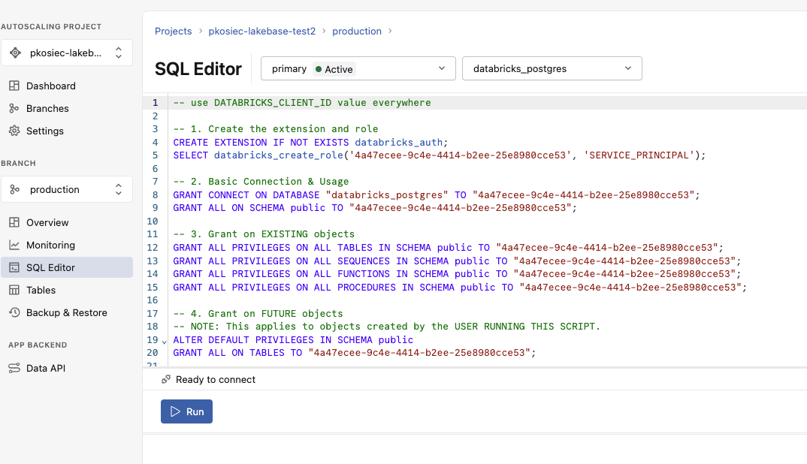
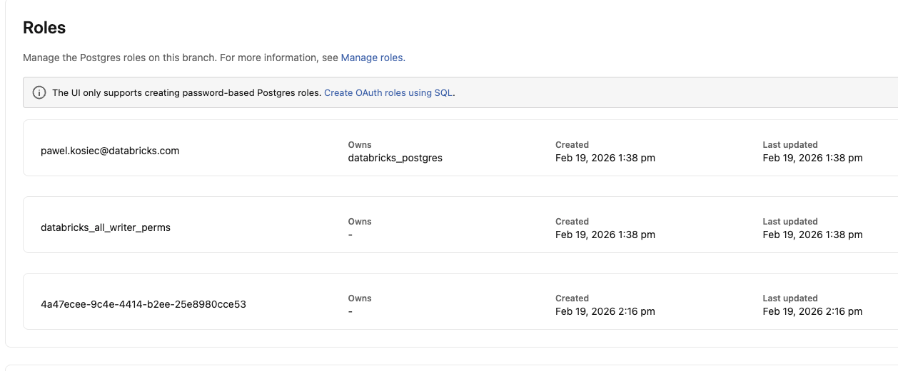

# Lakebase plugin

:::info
Currently, the Lakebase plugin currently requires a one-time manual setup to connect your Databricks App with your Lakebase database. An automated setup process is planned for an upcoming future release.
:::

Provides a PostgreSQL connection pool for Databricks Lakebase Autoscaling with automatic OAuth token refresh.

**Key features:**
- Standard `pg.Pool` compatible with any PostgreSQL library or ORM
- Automatic OAuth token refresh (1-hour tokens, 2-minute refresh buffer)
- Token caching to minimize API calls
- Built-in OpenTelemetry instrumentation (query duration, pool connections, token refresh)

## Setting up Lakebase

Before using the plugin, you need to connect your Databricks App's service principal to your Lakebase database.

### 1. Find your app's service principal

Create a Databricks App from the UI (`Compute > Apps > Create App > Create a custom app`). Navigate to the **Environment** tab and note the `DATABRICKS_CLIENT_ID` value — this is the service principal that will connect to your Lakebase database.



### 2. Find your Project ID and Branch ID

Create a new Lakebase Postgres Autoscaling project. Navigate to your Lakebase project's branch details and switch to the **Compute** tab. Note the **Project ID** and **Branch ID** from the URL.



### 3. Find your endpoint

Use the Databricks CLI to list endpoints for the branch. Note the `name` field from the output — this is your `LAKEBASE_ENDPOINT` value.

```bash
databricks postgres list-endpoints projects/{project-id}/branches/{branch-id}
```

Example output:

```json
[
  {
    "create_time": "2026-02-19T12:13:02Z",
    "name": "projects/{project-id}/branches/{branch-id}/endpoints/primary"
  }
]
```

### 4. Get connection parameters

Click the **Connect** button on your Lakebase branch and copy the `PGHOST` and `PGDATABASE` values for later.



### 5. Grant access to the service principal

Navigate to the **SQL Editor** tab on your Lakebase branch. Run the following SQL against the `databricks_postgres` database, replacing `<DATABRICKS_CLIENT_ID>` with the value from step 1 everywhere it appears:

```sql
-- 1. Create the extension and role
CREATE EXTENSION IF NOT EXISTS databricks_auth;
SELECT databricks_create_role('<DATABRICKS_CLIENT_ID>', 'SERVICE_PRINCIPAL');

-- 2. Basic connection & usage
GRANT CONNECT ON DATABASE "databricks_postgres" TO "<DATABRICKS_CLIENT_ID>";
GRANT ALL ON SCHEMA public TO "<DATABRICKS_CLIENT_ID>";

-- 3. Grant on existing objects
GRANT ALL PRIVILEGES ON ALL TABLES IN SCHEMA public TO "<DATABRICKS_CLIENT_ID>";
GRANT ALL PRIVILEGES ON ALL SEQUENCES IN SCHEMA public TO "<DATABRICKS_CLIENT_ID>";
GRANT ALL PRIVILEGES ON ALL FUNCTIONS IN SCHEMA public TO "<DATABRICKS_CLIENT_ID>";
GRANT ALL PRIVILEGES ON ALL PROCEDURES IN SCHEMA public TO "<DATABRICKS_CLIENT_ID>";

-- 4. Grant on future objects
-- NOTE: This applies to objects created by the user running this script.
ALTER DEFAULT PRIVILEGES IN SCHEMA public
  GRANT ALL ON TABLES TO "<DATABRICKS_CLIENT_ID>";
ALTER DEFAULT PRIVILEGES IN SCHEMA public
  GRANT ALL ON SEQUENCES TO "<DATABRICKS_CLIENT_ID>";
ALTER DEFAULT PRIVILEGES IN SCHEMA public
  GRANT ALL ON FUNCTIONS TO "<DATABRICKS_CLIENT_ID>";
ALTER DEFAULT PRIVILEGES IN SCHEMA public
  GRANT ALL ON ROUTINES TO "<DATABRICKS_CLIENT_ID>";
```



### 6. Verify the role

Navigate to the **Roles & Databases** tab and confirm the role is visible. You may need to fully refresh the page.



## Basic usage

```ts
import { createApp, lakebase, server } from "@databricks/appkit";

await createApp({
  plugins: [server(), lakebase()],
});
```

## Environment variables

The required environment variables:

| Variable | Description |
|---|---|
| `PGHOST` | Lakebase host |
| `PGDATABASE` | Database name |
| `LAKEBASE_ENDPOINT` | Endpoint resource path (e.g. `projects/.../branches/.../endpoints/...`) |
| `PGSSLMODE` | TLS mode — set to `require` |

Ensure that those environment variables are set both for local development (`.env` file) and for deployment (`app.yaml` file):

```yaml
env:
  - name: LAKEBASE_ENDPOINT
    value: projects/{project-id}/branches/{branch-id}/endpoints/primary
  - name: PGHOST
    value: {your-lakebase-host}
  - name: PGDATABASE
    value: databricks_postgres
  - name: PGSSLMODE
    value: require
```

For the full configuration reference (SSL, pool size, timeouts, logging, ORM examples), see the [`@databricks/lakebase` README](https://github.com/databricks/appkit/blob/main/packages/lakebase/README.md).

## Accessing the pool

After initialization, access Lakebase through the `AppKit.lakebase` object:

```ts
const AppKit = await createApp({
  plugins: [server(), lakebase()],
});

// Direct query (parameterized)
const result = await AppKit.lakebase.query(
  "SELECT * FROM orders WHERE user_id = $1",
  [userId],
);

// Raw pg.Pool (for ORMs or advanced usage)
const pool = AppKit.lakebase.pool;

// ORM-ready config objects
const ormConfig = AppKit.lakebase.getOrmConfig();  // { host, port, database, ... }
const pgConfig = AppKit.lakebase.getPgConfig();    // pg.PoolConfig
```

## Configuration options

Pass a `pool` object to override any defaults:

```ts
await createApp({
  plugins: [
    lakebase({
      pool: {
        max: 10,                      // Max pool connections (default: 10)
        connectionTimeoutMillis: 5000, // Connection timeout ms (default: 10000)
        idleTimeoutMillis: 30000,      // Idle connection timeout ms (default: 30000)
      },
    }),
  ],
});
```
